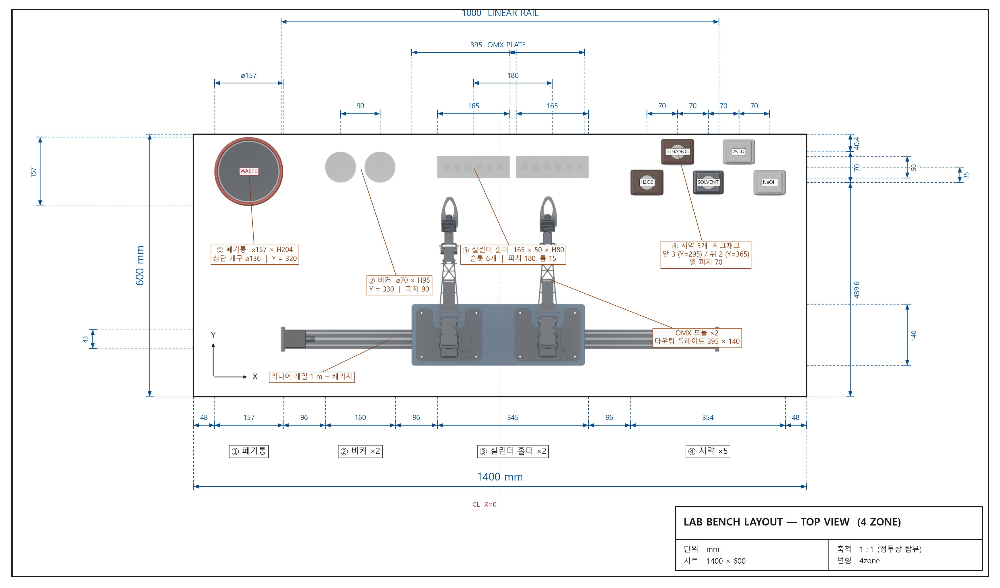
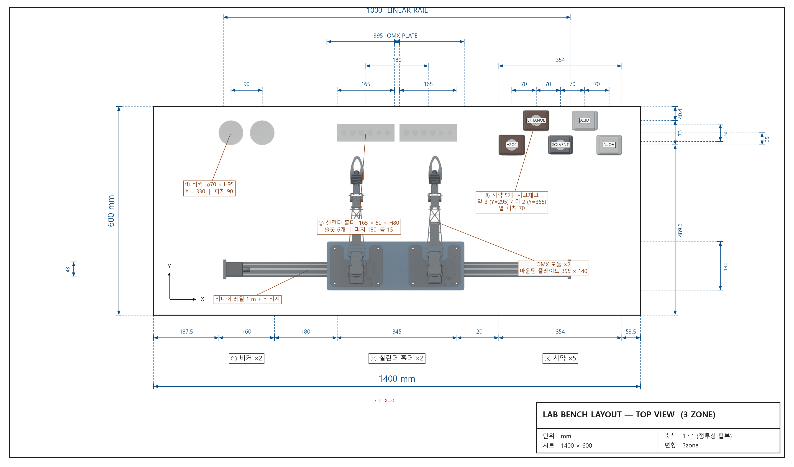

# SimulationEnv

Chemistry lab bench simulation environment: a 1 m lead-screw linear rail with
a prismatic carriage, two OpenMANIPULATOR-X mounts, and the bench props
(waste bucket, beakers, cylinder holders, five reagent bottles).

The Blender scene is the single source of truth for geometry and layout;
the drawings and the Gazebo worlds are both generated from it.

## Layouts

Two arrangements are kept on the same 1400 × 600 mm bench, and **both are
simulated**. Coordinates live in one file,
[`blender/scripts/layouts.py`](blender/scripts/layouts.py).

### 4-zone — default

**① 폐기통 → ② 비커 ×2 → ③ 실린더 홀더 ×2 → ④ 시약 ×5**, gaps 48 | 96 | 96 | 96 | 48



### 3-zone

**① 비커 ×2 → ② 실린더 홀더 ×2 → ③ 시약 ×5**, gaps 187.5 | 180 | 120 | 53.5,
holders centred on X = 0, no waste bucket



Reagents are staggered in both: 3 in the front row, 2 in the rear.
Full coordinate tables are in [`docs/layout.md`](docs/layout.md).

World frame: **+X right, +Y back, +Z up**, metres, and **Z = 0 is the bench
surface**. Blender and Gazebo share the frame exactly — no axis conversion
anywhere in the pipeline.

## Repository

```
blender/
  lab_bench.blend              source scene
  scripts/layouts.py           the layout variants — every coordinate
  scripts/build_layout.py      rebuild props + apply a variant (idempotent)
  scripts/render_topview.py    orthographic top render, 2 px/mm
  scripts/export_gazebo.py     scene -> gazebo/ models, meshes and worlds
drawings/
  draw_topview.py              dimensioned drawings from the top renders
  topview_<variant>.png        top renders (transparent background)
  bench_topview_<variant>.png  the dimensioned drawings
gazebo/
  models/<name>/model.sdf      one model per prop / assembly
  models/<name>/meshes/*.obj   visual meshes (+ .mtl)
  worlds/lab_bench.world       4-zone bench
  worlds/lab_bench_3zone.world 3-zone bench
ros2/
  simulation_env_bringup/      launch + ros_gz_bridge config
run_gazebo.sh                  run a world in the open-manipulator container
docs/layout.md
```

## Running it

Tested against **Gazebo Sim (Harmonic)** with **ROS 2** and `ros_gz`.

### Without installing anything

`run_gazebo.sh` runs a world inside the `robotis/open-manipulator:5.0.0`
container, which already carries Gazebo Harmonic and `ros_gz`. It mounts the
repo at `/sim`, forwards X11 and passes `/dev/dri` through when the host has
one.

```bash
./run_gazebo.sh              # 4 zone, GUI
./run_gazebo.sh 3zone        # 3 zone, GUI
./run_gazebo.sh 4zone -s     # server only
./run_gazebo.sh ros          # colcon build + ros2 launch + ros_gz_bridge
./run_gazebo.sh ros 3zone
```

### Gazebo on its own

```bash
export GZ_SIM_RESOURCE_PATH=$PWD/gazebo/models:$GZ_SIM_RESOURCE_PATH
gz sim -r gazebo/worlds/lab_bench.world          # 4 zone
gz sim -r gazebo/worlds/lab_bench_3zone.world    # 3 zone
```

### With ROS 2

```bash
mkdir -p ~/ws/src && cd ~/ws/src
git clone https://github.com/armchemist/SimulationEnv.git
cd ~/ws
colcon build --packages-select simulation_env_bringup
source install/setup.bash

ros2 launch simulation_env_bringup lab_bench.launch.py                 # 4 zone
ros2 launch simulation_env_bringup lab_bench.launch.py layout:=3zone   # 3 zone
```

Also accepts `gui:=false` (server only) and `paused:=true`.

Drive the carriage (metres, ±0.42 from the rail centre):

```bash
ros2 topic pub --once /rail_axis/carriage_slide/cmd_pos \
    std_msgs/msg/Float64 "{data: 0.30}"
ros2 topic echo /rail_axis/joint_states
```

The rail plugins publish on world-independent topics, so one bridge config
serves both worlds.

## Regenerating from Blender

```bash
export SIMENV_REPO=$PWD

# meshes, model.sdf and BOTH world files — the scene's current variant
# does not matter, mesh origins sit on each model's own base
blender blender/lab_bench.blend --background \
    --python blender/scripts/export_gazebo.py

# one top render per variant
for v in 4zone 3zone; do
  SIMENV_VARIANT=$v blender blender/lab_bench.blend --background \
      --python blender/scripts/build_layout.py \
      --python blender/scripts/render_topview.py
done

# both dimensioned drawings
python drawings/draw_topview.py
```

`export_gazebo.py` writes visuals from the exported meshes but keeps
**collisions as primitives** (box / cylinder from the measured bounding
boxes) — mesh collisions are slow and unstable for small props. Masses and
inertias are analytic for those primitives; they are plausible, not weighed.

## Models

Shared by both worlds; only the poses differ.

| Model | Collision | Mass (kg) | Notes |
|---|---|---:|---|
| `waste_bucket` | cylinder ⌀157 × 204 | 0.45 | 4-zone only |
| `beaker` | cylinder ⌀70 × 95 | 0.15 | spawned twice |
| `cylinder_holder` | box 165 × 50 × 80 | 0.25 | spawned twice, 6 slots |
| `reagent_bottle_h2o2` | box 75 × 58 × 172 | 0.55 | amber |
| `reagent_bottle_ethanol` | box 75 × 58 × 172 | 0.55 | amber |
| `reagent_bottle_solvent` | box 70 × 54 × 179 | 0.52 | dark |
| `reagent_bottle_acid` | box 73 × 56 × 187 | 0.60 | white |
| `reagent_bottle_naoh` | box 73 × 56 × 187 | 0.60 | white |
| `rail_axis` | composite | 6.8 | rail + carriage, prismatic X, ±0.42 m |
| `linear_rail` | box 1000 × 56 × 73 | 6.0 | mesh source for `rail_axis` |
| `rail_carriage` | box 80 × 60 × 62 | 0.8 | mesh source for `rail_axis` |
| `omx_mounting_plate` | box 395 × 140 × 6 | 1.2 | static |
| `omx_module` | box 150 × 375 × 277 | 1.5 | static visual placeholder |

Both worlds also carry `bench_walls`, a static 150 mm white kerb 20 mm thick
around the bench edge, so props that get knocked cannot fall off the surface.
It is written straight into the world files by `export_gazebo.py`.

`linear_rail` and `rail_carriage` are not placed in either world directly —
`rail_axis` references their meshes and adds the joint — but their model
directories must stay on `GZ_SIM_RESOURCE_PATH`.

## The arm

`omx_module` is a **single fused, decimated mesh (26k triangles)**. It is a
visual placeholder: it does not articulate and has no joints. For real
manipulation, drop the official OpenMANIPULATOR-X description in and delete
the two `omx_module` includes from the world files. Mount poses to reuse:

| | X | Y | Z |
|---|---:|---:|---:|
| left | −0.116527 | 0.074456 | 0.0735 |
| right | 0.108469 | 0.075270 | 0.0735 |

Z is the top face of `omx_mounting_plate`.

## License

Apache-2.0.
