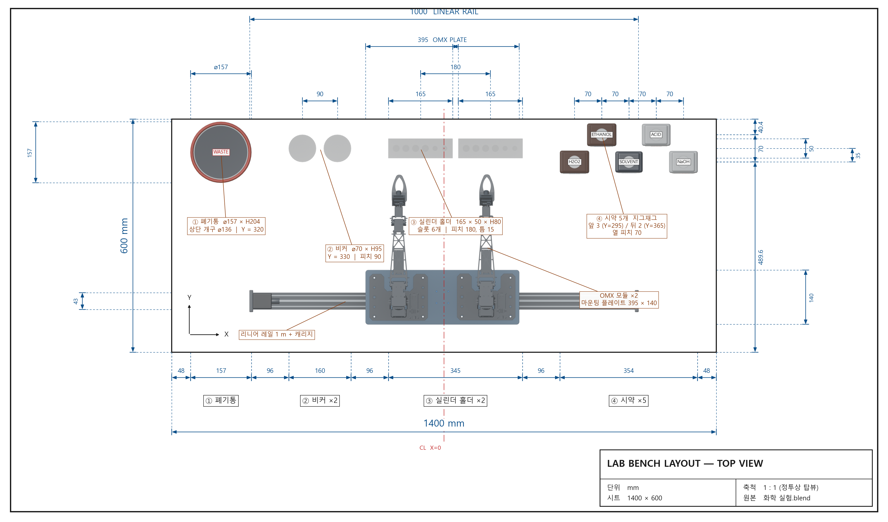

# Bench layout

All coordinates are millimetres in the Blender/Gazebo world frame:
**+X right, +Y back, +Z up**, and **Z = 0 is the bench surface**.
The display floor spans X −700 … +700 and Y −194.6 … +405.4 (1400 × 600).

## Zones, left to right

| # | Zone | X span | Width | Gap before |
|---|------|--------|-------|------------|
| ① | 폐기통 Waste bucket | −652.0 … −495.0 | 157.0 | 48.0 (left edge) |
| ② | 비커 Beaker ×2 | −399.0 … −239.0 | 160.0 | 96.0 |
| ③ | 실린더 홀더 Cylinder holder ×2 | −143.0 … 202.0 | 345.0 | 96.0 |
| ④ | 시약 Reagent ×5 | 298.0 … 652.0 | 354.0 | 96.0 |
|   | right edge | | | 48.0 |

Chain totals exactly 1400 mm.

## Object placement

| Object | X | Y | Footprint | Height |
|---|---:|---:|---|---:|
| `Waste_Bucket` | −573.5 | 320 | ⌀157 (opening ⌀136) | 203.8 |
| `beaker_01` | −364.0 | 330 | ⌀70 | 95 |
| `beaker_02` | −274.0 | 330 | ⌀70 | 95 |
| `rack_01` | −60.5 | 330 | 165 × 50 | 80 |
| `rack_02` | 119.5 | 330 | 165 × 50 | 80 |
| `Chemical_Bottle_H2O2` | 335.5 | 295 | 75 × 58 | 172 |
| `Chemical_Bottle_ETHANOL` | 405.5 | 365 | 75 × 58 | 172 |
| `Chemical_Bottle_SOLVENT` | 475.5 | 295 | 70 × 54 | 179 |
| `Chemical_Bottle_ACID` | 545.5 | 365 | 73 × 56 | 187 |
| `Chemical_Bottle_NAOH` | 615.5 | 295 | 73 × 56 | 187 |

Pitches: beakers 90, holders 180 (15 gap), reagent columns 70.
Reagents are staggered — 3 in the front row (Y = 295), 2 in the rear row
(Y = 365), 70 apart.

## Fixed hardware

| Part | Extent |
|---|---|
| Linear rail base | X −500 … 500, Y −84.5 … −41.5, Z 0 … 4 |
| Guide rails | X ±491, Y −51/−79, Z 4 … 10 |
| Lead screw | X ±425, ⌀8 at Z 20 … 28 |
| Drive motor | X −491 … −443, 48 × 40 × 40 |
| Carriage | 75 × 43 × 8 base, top plate 60 × 40 × 14, payload 80 × 60 × 40 |
| OMX mounting plate | 395 × 140 × 6, Z 67.5 … 73.5 |
| OMX modules ×2 | centres X −116.5 / 108.5, Y 74.5, Z 75.5 … 352.4 |

Carriage travel used in the SDF is ±420 mm, inside the ±453.5 mm the end
plates allow and comfortably inside the ±425 mm lead screw.

## Known gaps

- `OMX_Module_Left` / `OMX_Module_Right` still carry an unapplied object
  scale of 2.5 in the .blend. The exporter bakes it, so Gazebo is correct,
  but applying it in Blender would be tidier.
- The OMX arm is exported as a single decimated visual mesh. It does not
  articulate — see the README for wiring in the real
  `open_manipulator` description.
- `Beaker_Label_500mL` is an orphan text object left over from a deleted
  beaker; it sits outside the bench at Y ≈ 494 and is not exported.
